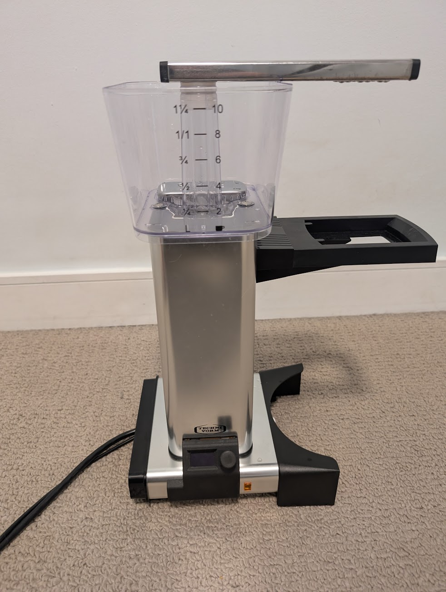

MoccaWake
==========
A wifi-connected wake up timer for the [Mocca Master KGBT](https://us.moccamaster.com/products/kbgt?variant=40200137670819) coffee machine.

## Features

 * Small OLED screen and rotary encoder for setting the wake up timer and controlling the brew.
 * The ESP32 controller has WIFI and NTP which doesn't lose time after power outages.
 * Two button presses to "just brew coffee".
 * No visible components except input panel.
 * Fully reversible.

## Motivation

This project combines two hobbies of mine: coffee and software engineering.
After installing the [Gaggiunio](https://github.com/Zer0-bit/gaggiuino) mod on an espresso machine I wanted to explore designing a coffee machine mod from scratch.
It was an opportunity to learn simple circuit design, CAD, 3D printing and embedded programming.

## License

The MoccaWake is licensed under [Creative Commons Attribution-NonCommercial 4.0 International License](https://creativecommons.org/licenses/by-nc/4.0).

These designs and software may be freely reproduced, modified, and manufactured for personal use only.

